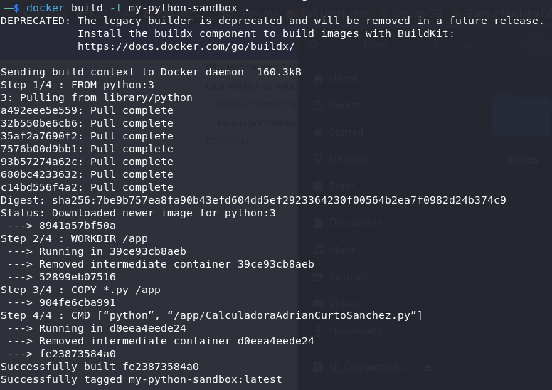

# Unidad 1 - Actividad 4.RA1. Prueba de aplicaciones en entorno controlado: Sandbox

## Diferentes Sandboxes

Podemos encontrar multitud de herramientas que nos ofrecen crear "sandboxes" en los cuales poder probar software de forma aislada. A continuación encontrás tres de estas herramientas:

- <a href="https://learn.microsoft.com/es-es/windows/security/application-security/application-isolation/windows-sandbox/" target="_blank">Espacio aislado de Windows</a>
- <a href="https://blog.cloudflare.com/sandboxing-in-linux-with-zero-lines-of-code/" target="_blank">Linux seccomp</a>
- <a href="https://medium.com/@alwinraju/how-to-use-docker-to-sandbox-a-python-script-5fba21df481f" target="_blank">Contenedor Docker</a>


## Ejecución de código sobre un sandbox creado con Docker

### Creación del dockerfile

``` dockerfile
FROM python:3-alpine

RUN apk update && apk add tk

WORKDIR /app

ENV DISPLAY=:0

COPY *.py /app

CMD ["python", "/app/calculadoraGrafica.py"]
```
[Fichero dockerfile](dockerfile)


### Convertir dockefile en una imagen

Una vez tenemos nuestro dockerfile creado deberemos crear la imagen con el siguiente comando `docker build -t my-python-sandbox .` con el parámetro `-t` indicamos a continuación el nombre de la imagen(tag) y con `.` especicamos el contexto de la construcción de la imagen se encuentra en el directorio actual.



### Ejecución del contenedor
Es posible que necesitemos instalar las siguientes dependencias:
`sudo apt-get install x11-xserver-utils`

Primero debemos dar permisos a docker para que pueda usar el servicio de entorno gráfico de la máquina anfitrión:
`xhost +local:docker`

Y ejecutamos el contenedor de con el parámetro `--rm` de tal forma que al finalizar la ejecución del programa el contenedor se borra  `docker run --rm -v /tmp/.X11-unix:/tmp/.X11-unix -e DISPLAY=$DISPLAY my-python-sandbox`

